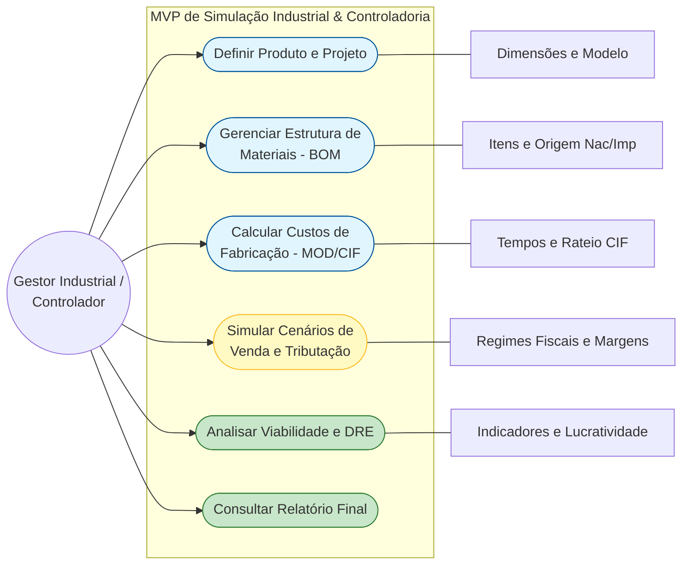

# Documentação do Sistema - Diagrama de Casos de Uso

Este documento apresenta o diagrama de casos de Uso do **MVP de Simulação Industrial & Controladoria**, representando as principais interações do usuário (Ator) com as funcionalidades do sistema (Requisitos Funcionais).

## Requisitos Funcionais Mapeados

1.  **Definir Produto e Projeto**: Entrada de dados técnicos básicos (dimensões, peso estimado e nome do modelo).
2.  **Gerenciar Estrutura de Materiais (BOM)**: Listagem de insumos, diferenciando origem nacional e importada (impacto tributário).
3.  **Calcular Custos de Fabricação (MOD/CIF)**: Cálculo de Mão de Obra Direta com encargos e Custos Indiretos por absorção.
4.  **Simular Cenários de Venda e Tributação**: Configuração de markup, regime tributário (Lucro Real/Presumido) e destino.
5.  **Analisar Viabilidade e DRE**: Visualização da saúde financeira do projeto através da Demonstração do Resultado do Exercício.
6.  **Consultar Relatório Final**: Consolidação de todos os cálculos em uma visão de controladoria.
